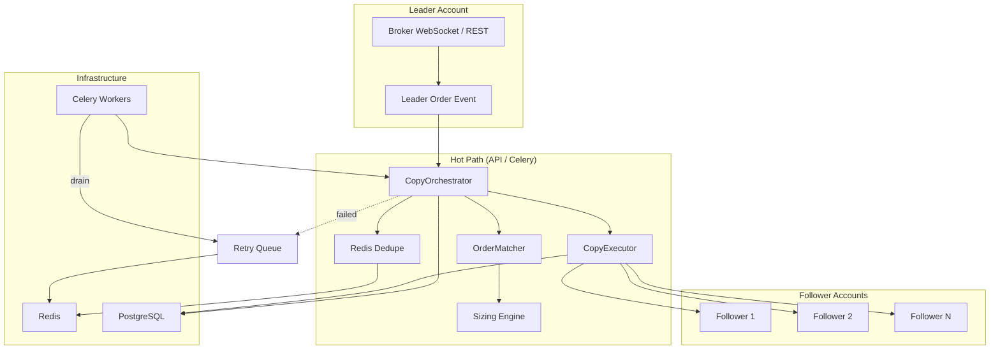
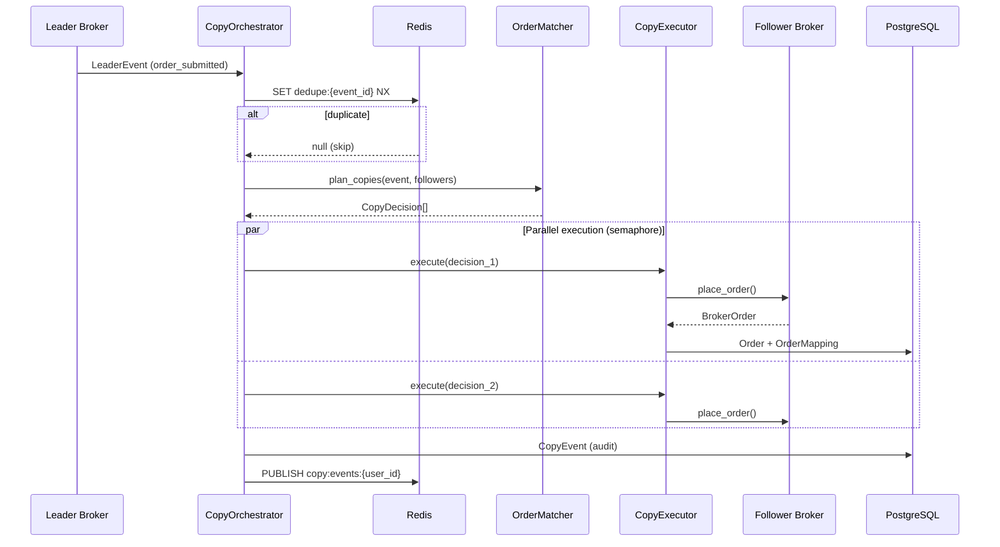
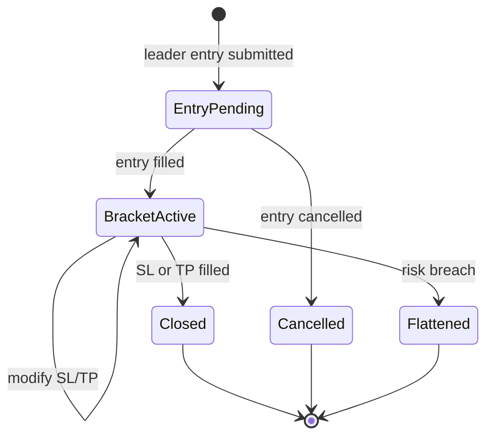
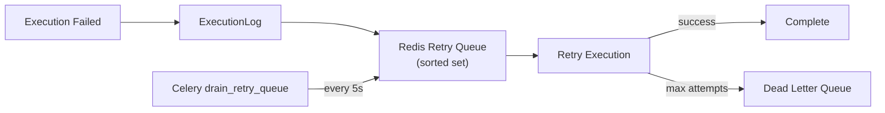
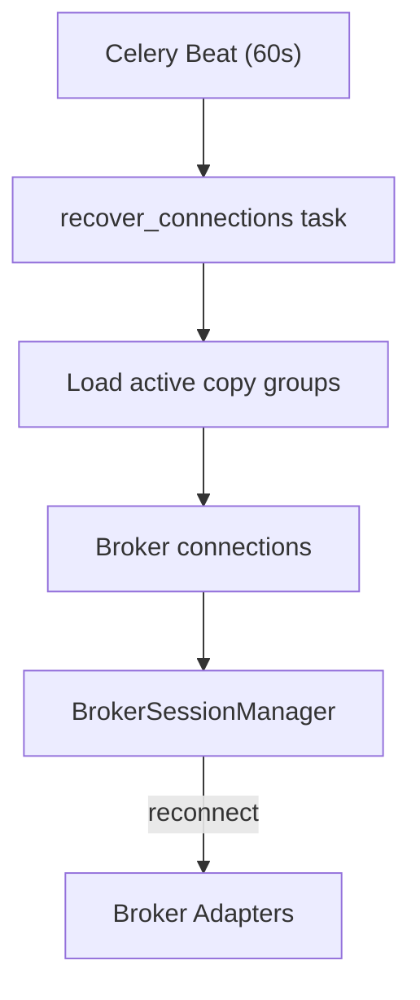
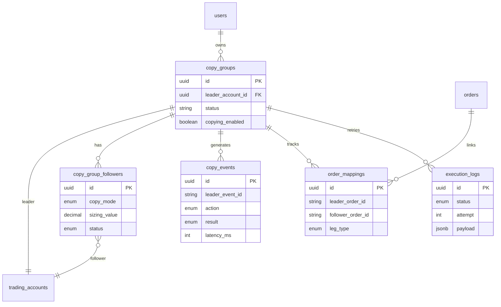

# Copy Engine Architecture

TradeFlow's copy engine is the heart of the platform — it replicates leader trades to follower accounts with configurable sizing, ultra-low latency execution, and fault tolerance.

## System Overview



## Data Flow — Leader Event to Follower Execution



## Copy Modes

| Mode                      | Formula                    | Example                               |
| ------------------------- | -------------------------- | ------------------------------------- |
| **Fixed Quantity**        | `sizing_value`             | Leader buys 5 → Follower buys 3       |
| **Risk Multiplier**       | `leader_qty × multiplier`  | Leader buys 2, 2× → Follower buys 4   |
| **Percentage Allocation** | `leader_qty × (pct / 100)` | Leader buys 10, 50% → Follower buys 5 |
| **Reverse Copy**          | Same qty, flipped side     | Leader BUY 2 → Follower SELL 2        |

Partial fills scale proportionally: if leader fills 50% of a 10-lot order, the follower fills 50% of its calculated size.

## Order Types

Supported order types flow through the engine to broker adapters:

| Type            | Use Case                  |
| --------------- | ------------------------- |
| `market`        | Immediate execution       |
| `limit`         | Price-targeted entry/exit |
| `stop`          | Stop entry                |
| `stop_limit`    | Stop with limit price     |
| `stop_loss`     | Bracket stop leg          |
| `take_profit`   | Bracket target leg        |
| `trailing_stop` | Trailing stop leg         |

Bracket legs are tracked via `OrderMapping.leg_type` (`entry`, `stop`, `target`, `trailing`).

## Bracket Order State Machine



## Retry & Failure Handling



- Exponential backoff: 1s, 2s, 4s, 8s, 16s
- Default max attempts: 5 (`COPY_RETRY_MAX_ATTEMPTS`)
- Dead-letter queue for manual investigation

## Connection Recovery



On disconnect, the broker adapter's auto-reconnect kicks in immediately. Celery beat provides a periodic safety net for sessions lost during API restarts.

## Module Layout

```
apps/api/src/tradeflow/
├── engine/
│   ├── types.py          # LeaderEvent, CopyDecision, FollowerContext
│   ├── sizing.py         # Copy mode calculations + partial fills
│   ├── order_types.py    # Order type normalization
│   ├── matching.py       # OrderMatcher — plan decisions
│   ├── mapping.py        # TradeMappingStore — Redis + DB
│   ├── executor.py       # CopyExecutor — broker I/O
│   ├── orchestrator.py   # CopyOrchestrator — hot path
│   ├── retry_queue.py    # Redis sorted-set retry queue
│   ├── sync.py           # Position/order reconciliation
│   └── recovery.py       # Connection recovery
├── features/copy_trading/
│   ├── router.py         # /api/v1/copy/*
│   ├── service.py        # Group CRUD + simulate
│   └── schemas.py        # Pydantic models
├── workers/
│   └── copy_tasks.py     # Celery tasks
└── db/models/
    └── copy_trading.py   # CopyGroup, CopyEvent, OrderMapping, ExecutionLog
```

## Database Schema



## Redis Keys

| Key Pattern                                            | Purpose                                  | TTL |
| ------------------------------------------------------ | ---------------------------------------- | --- |
| `copy:dedupe:{event_id}`                               | Idempotency                              | 24h |
| `copy:mapping:{group}:{leader_order}:{follower}:{leg}` | Order mapping cache                      | 7d  |
| `copy:retry:queue`                                     | Retry sorted set (score = next_retry_at) | —   |
| `copy:retry:dead_letter`                               | Failed after max retries                 | —   |
| `copy:events:{user_id}`                                | Pub/sub for real-time UI                 | —   |

## API Endpoints

| Method | Path                                      | Description       |
| ------ | ----------------------------------------- | ----------------- |
| POST   | `/api/v1/copy/groups`                     | Create copy group |
| GET    | `/api/v1/copy/groups`                     | List groups       |
| POST   | `/api/v1/copy/groups/{id}/followers`      | Add follower      |
| POST   | `/api/v1/copy/groups/{id}/start`          | Start copying     |
| POST   | `/api/v1/copy/groups/{id}/stop`           | Stop copying      |
| GET    | `/api/v1/copy/groups/{id}/events`         | Audit log         |
| GET    | `/api/v1/copy/groups/{id}/execution-logs` | Retry logs        |
| POST   | `/api/v1/copy/groups/{id}/simulate`       | Inject test event |
| GET    | `/api/v1/copy/health`                     | Engine metrics    |

## Configuration

| Variable                             | Default | Description                      |
| ------------------------------------ | ------- | -------------------------------- |
| `COPY_RETRY_MAX_ATTEMPTS`            | 5       | Max retry attempts per execution |
| `COPY_MAX_PARALLEL_FOLLOWERS`        | 10      | Concurrent follower executions   |
| `COPY_HEALTH_CHECK_INTERVAL_SECONDS` | 15      | Health probe interval            |

## Latency Design

1. **Dedupe in Redis** — O(1) SET NX, no DB round-trip on duplicates
2. **Order mapping cache** — Redis first, DB fallback
3. **Parallel follower execution** — `asyncio.gather` with semaphore
4. **Async audit persist** — single flush after all followers complete
5. **Celery offload** — optional async path via `process_leader_event` task for non-blocking API

## Celery Tasks

| Task                   | Schedule  | Queue  |
| ---------------------- | --------- | ------ |
| `process_leader_event` | On demand | `copy` |
| `drain_retry_queue`    | Every 5s  | `copy` |
| `recover_connections`  | Every 60s | `copy` |
| `sync_copy_groups`     | On demand | `copy` |
