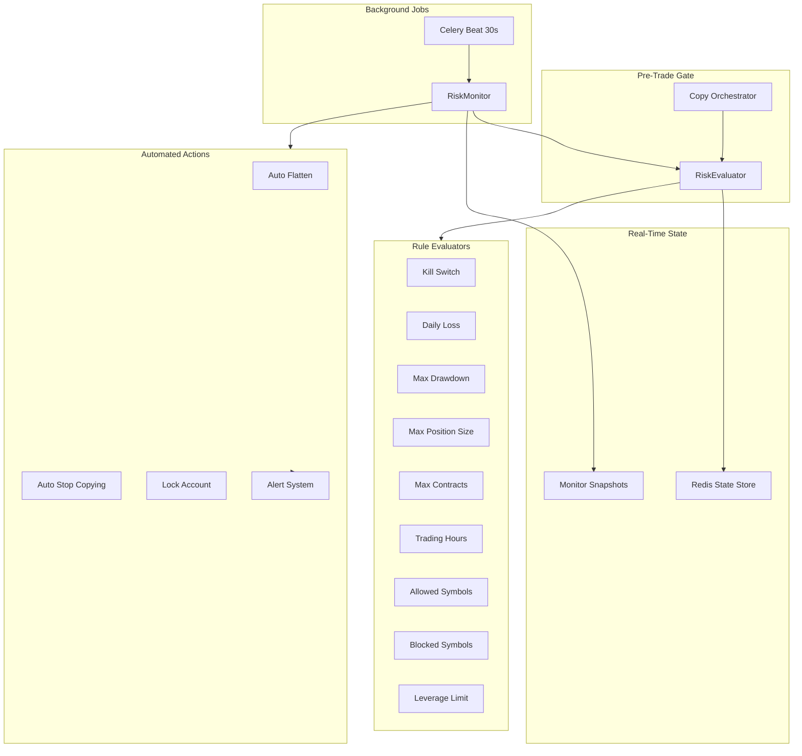
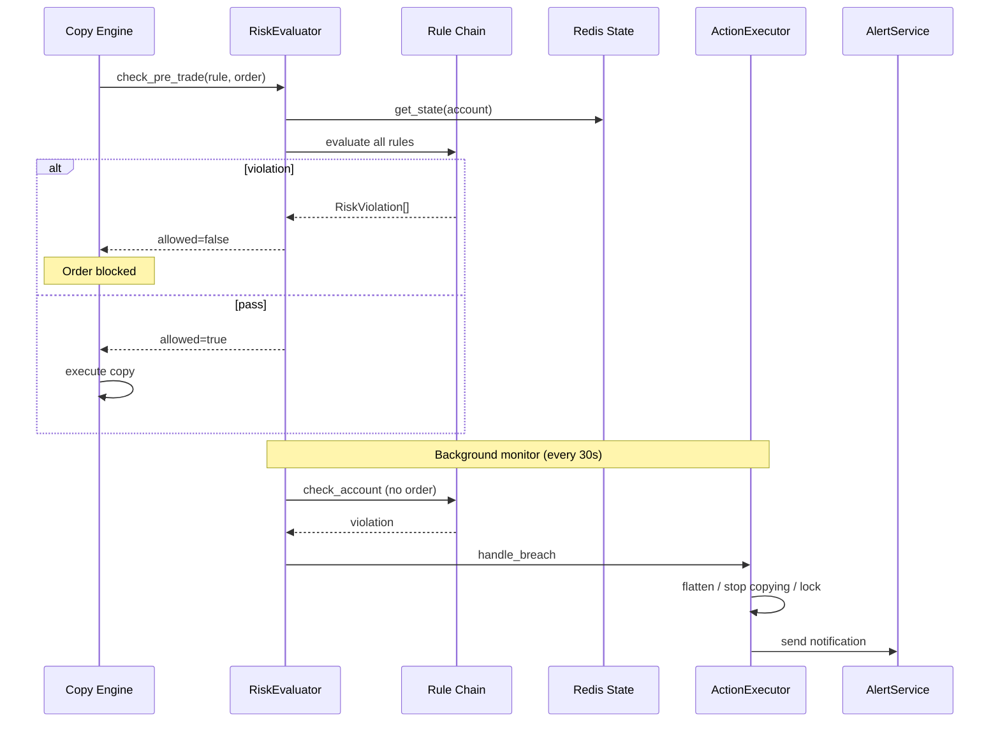
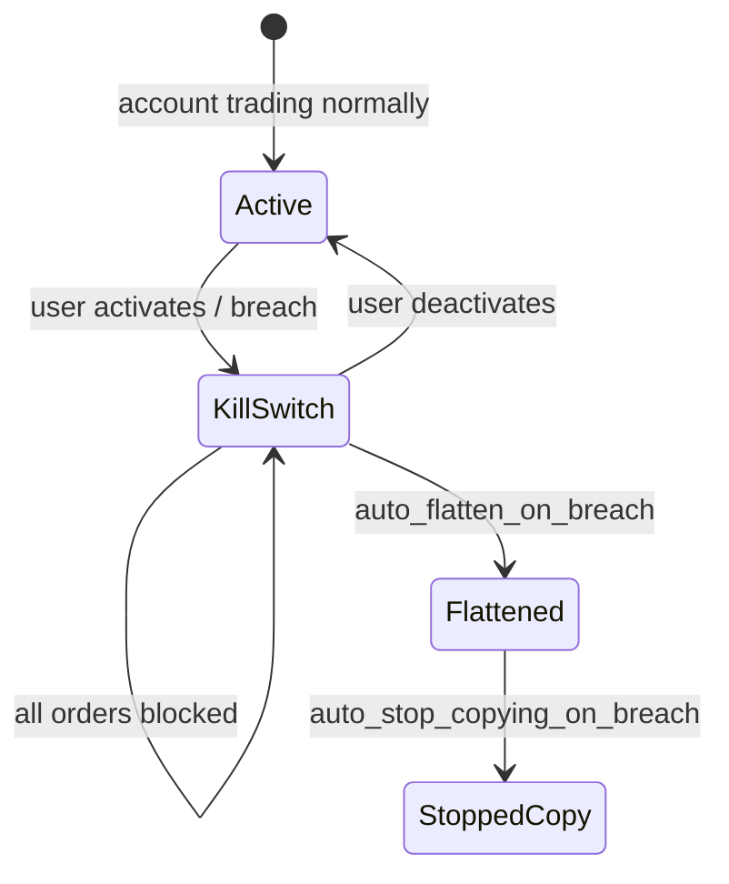
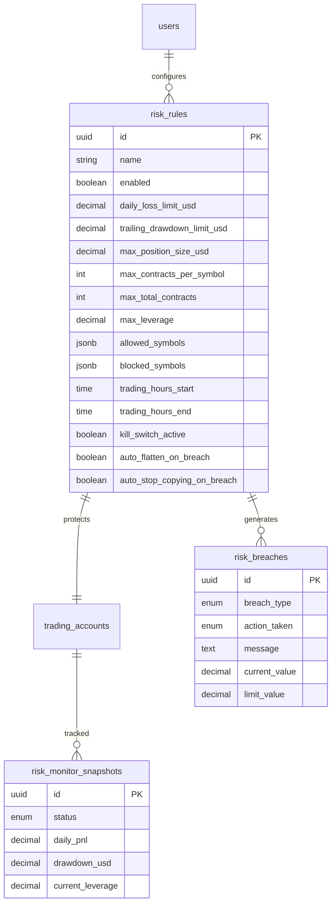

# Risk Engine Architecture

TradeFlow's risk engine protects follower accounts with user-configurable rules, real-time monitoring, automated breach responses, and a kill switch.

## System Overview



## Rule Evaluation Flow



## Configurable Rules

| Rule                  | Field                         | Action on Breach    |
| --------------------- | ----------------------------- | ------------------- |
| **Daily Loss**        | `daily_loss_limit_usd`        | Stop copying        |
| **Max Drawdown**      | `trailing_drawdown_limit_usd` | Flatten positions   |
| **Max Position Size** | `max_position_size_usd`       | Block order         |
| **Max Contracts**     | `max_total_contracts`         | Block order         |
| **Max Per Symbol**    | `max_contracts_per_symbol`    | Block order         |
| **Trading Hours**     | `start/end/timezone`          | Block order         |
| **Allowed Symbols**   | `allowed_symbols[]`           | Block order         |
| **Blocked Symbols**   | `blocked_symbols[]`           | Block order         |
| **Leverage Limit**    | `max_leverage`                | Block order         |
| **Kill Switch**       | `kill_switch_active`          | Block all + flatten |

All rules are individually enable/disable via `enabled` flag. Automated responses configurable via `auto_flatten_on_breach` and `auto_stop_copying_on_breach`.

## Kill Switch State Machine



## Database Schema



## Redis Keys

| Key                       | Purpose                                      |
| ------------------------- | -------------------------------------------- |
| `risk:state:{account_id}` | Real-time P&L, drawdown, contracts, leverage |
| `risk:status:{user_id}`   | Pub/sub for live UI updates                  |

## API Endpoints

| Method | Path                                             | Description          |
| ------ | ------------------------------------------------ | -------------------- |
| POST   | `/api/v1/risk/rules`                             | Create risk rule     |
| GET    | `/api/v1/risk/rules`                             | List all rules       |
| PUT    | `/api/v1/risk/rules/{id}`                        | Update configuration |
| DELETE | `/api/v1/risk/rules/{id}`                        | Delete rule          |
| POST   | `/api/v1/risk/rules/{id}/kill-switch/activate`   | Kill switch ON       |
| POST   | `/api/v1/risk/rules/{id}/kill-switch/deactivate` | Kill switch OFF      |
| POST   | `/api/v1/risk/accounts/{id}/flatten`             | Manual flatten       |
| GET    | `/api/v1/risk/accounts/{id}/status`              | Live monitor status  |
| GET    | `/api/v1/risk/breaches`                          | Breach history       |
| POST   | `/api/v1/risk/accounts/{id}/check`               | Pre-trade check      |

## Celery Background Jobs

| Task                   | Schedule  | Queue  |
| ---------------------- | --------- | ------ |
| `monitor_all_accounts` | Every 30s | `risk` |
| `reset_daily_sessions` | Every 1h  | `risk` |

## Module Layout

```
apps/api/src/tradeflow/risk/
├── types.py       # ProposedOrder, AccountRiskState, RiskCheckResult
├── state.py       # Redis state store
├── rules.py       # Individual rule evaluators (Strategy pattern)
├── evaluator.py   # Orchestrates all rules
├── actions.py     # Flatten, stop copying, kill switch
├── alerts.py      # Notifications + pub/sub
└── monitor.py     # Background account monitoring

apps/api/src/tradeflow/features/risk/
├── router.py      # REST API
├── service.py     # Business logic
└── schemas.py     # Pydantic models
```

## Integration with Copy Engine

The copy orchestrator calls `RiskEvaluator.check_pre_trade()` before every follower order placement. Blocked orders are logged in copy events with `risk_blocked` reason. Background monitor catches breaches from P&L/drawdown changes between trades.
