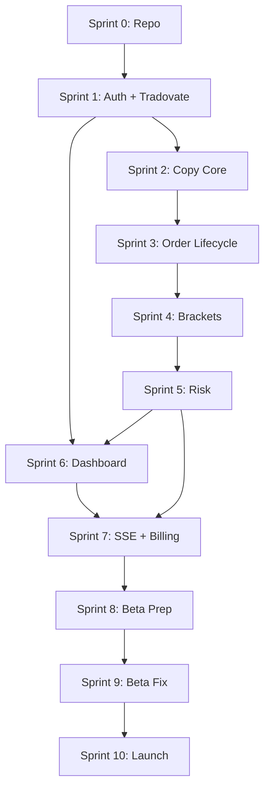

# Development Roadmap
## Relay MVP — Implementation Plan

**Version:** 1.0  
**Date:** June 26, 2026  
**Phase:** 0B  
**Timeline:** 12 weeks (3 months)  
**Team:** 2 engineers + 1 part-time designer

---

## 1. Roadmap Overview

```
Week:  1   2   3   4   5   6   7   8   9  10  11  12
       ├───┴───┤
       M0 Foundation
               ├───────────┤
               M1 Copy Engine
                           ├───┤
                           M2 Brackets + Risk
                               ├───────┤
                               M3 Dashboard
                                       ├───────┤
                                       M4 Beta
                                               ├─┤
                                               M5 Launch
```

| Milestone | Weeks | Exit Criteria |
|-----------|-------|---------------|
| **M0** Foundation | 1–2 | User auth, DB schema, Tradovate connect POC, CI green |
| **M1** Copy Engine | 3–5 | Sim copy: market/limit/stop; audit log; dedupe |
| **M2** Brackets + Risk | 6–7 | Bracket copy; daily loss flatten+lock; reconciliation |
| **M3** Dashboard | 8–9 | Full UI, SSE feed, email alerts, Stripe billing |
| **M4** Beta | 10–11 | 10 beta users, 50+ automated scenarios pass |
| **M5** Launch | 12 | Public Starter tier, docs, status page |

---

## 2. Sprint Breakdown (2-Week Sprints)

### Sprint 0 — Repo & Infrastructure (Week 1)
**Goal:** Monorepo scaffold, local dev environment, CI pipeline

| Task | Owner | Done When |
|------|-------|-----------|
| Initialize Turborepo + pnpm workspaces | Eng-1 | `pnpm dev` starts postgres + redis |
| Docker Compose: PostgreSQL, Redis, Mailpit | Eng-1 | Services healthy |
| `@relay/shared`, `@relay/db` schema v1 | Eng-2 | Migrations run clean |
| GitHub Actions: lint, typecheck, test | Eng-2 | PR checks pass |
| Terraform staging skeleton (RDS, Redis, ECS) | Eng-1 | `terraform plan` succeeds |
| `.env.example` + dev scripts | Eng-1 | README documents setup |

**Deliverable:** Empty apps compile; DB migrates; CI green on main.

---

### Sprint 1 — Auth & Accounts (Week 2)
**Goal:** M0 complete — users can register and connect Tradovate demo account

| Task | Owner | Done When |
|------|-------|-----------|
| Lucia auth in `apps/api` | Eng-2 | Register, login, logout, session |
| Email verification (Resend + Mailpit dev) | Eng-2 | Verify link works |
| `broker-tradovate`: REST token + WS connect | Eng-1 | Smoke script connects demo account |
| `broker-tradovate`: WS auth + heartbeat + syncrequest | Eng-1 | Receives position events |
| Credential encryption (KMS localstack dev) | Eng-1 | Encrypted blob in DB |
| API: `POST /broker-accounts/connect` | Eng-2 | Returns connected status |
| Engine: Connection Manager skeleton | Eng-1 | Connects on Redis command |
| Designer: Wireframes for dashboard, onboarding | Design | Figma approved |

**Deliverable:** M0 exit — Tradovate demo account connects; positions visible in logs.

---

### Sprint 2 — Copy Engine Core (Weeks 3–4)
**Goal:** Sim mode market/limit/stop copy with audit log

| Task | Owner | Done When |
|------|-------|-----------|
| `LeaderEvent` mapper from Tradovate WS | Eng-1 | Unit tests pass |
| `copy-core`: dedupe, size calculator | Eng-1 | Ratio + fixed sizing tests |
| `copy-core`: copy orchestrator (sim mode) | Eng-1 | 10 followers parallel |
| Engine: leader event → orchestrator pipeline | Eng-1 | End-to-end sim log |
| `@relay/db`: copy_events append-only repo | Eng-2 | Insert-only role configured |
| API: copy group CRUD | Eng-2 | Create group with leader + followers |
| API: engine command publish on config change | Eng-2 | Engine reloads within 1s |
| Integration test: market order sim copy | Eng-1 | CI passes |

**Deliverable:** Leader market order → 3 follower sim events in audit log.

---

### Sprint 3 — Order Lifecycle (Week 5)
**Goal:** M1 complete — modify, cancel, limit, stop in sim

| Task | Owner | Done When |
|------|-------|-----------|
| Order mapping store (Redis) | Eng-1 | Leader→follower ID lookup |
| Modify propagation | Eng-1 | Price change on follower sim log |
| Cancel propagation | Eng-1 | Cancel reflected in sim log |
| Limit + stop order copy (sim) | Eng-1 | Integration tests pass |
| Latency measurement instrumentation | Eng-1 | `latency_ms` in copy_events |
| Retry logic (3× backoff) + pause follower | Eng-1 | Failure scenarios tested |
| Load test: 10 followers × 10 orders/min | Eng-2 | P95 < 80ms in staging |

**Deliverable:** M1 exit — 50 sim scenarios in test suite; P95 latency measured.

---

### Sprint 4 — Brackets (Week 6)
**Goal:** Bracket order replication in sim + live on demo

| Task | Owner | Done When |
|------|-------|-----------|
| Bracket leg detection (parentOrderId) | Eng-1 | Entry + SL + TP mapped |
| Bracket copy: submit all legs | Eng-1 | Demo account bracket copied |
| Bracket modify/cancel lifecycle | Eng-1 | SL price change propagates |
| Partial fill handling | Eng-1 | Qty adjusted on fill events |
| Live mode toggle + sim_validated gate | Eng-2 | API enforces gate |
| API: sim test wizard endpoint | Eng-2 | Marks group sim_validated |

**Deliverable:** Bracket order copied live on Tradovate demo with 2 followers.

---

### Sprint 5 — Risk Management (Week 7)
**Goal:** M2 complete — daily loss, contract caps, reconciliation

| Task | Owner | Done When |
|------|-------|-----------|
| `@relay/risk`: pre-copy evaluator | Eng-1 | Caps block oversize orders |
| `@relay/risk`: P&L monitor on fills | Eng-1 | Daily P&L tracked per follower |
| Breach handler: flatten + lock | Eng-1 | 10/10 breach tests pass in < 2s |
| Per-follower isolation verified | Eng-1 | Breach on A doesn't stop B |
| Manual unlock flow (API + engine) | Eng-2 | Unlock restores copying |
| Reconciliation worker (5s drift check) | Eng-2 | Drift alert fires in test |
| Token refresh worker (85 min) | Eng-2 | Token renewed without disconnect |
| Daily P&L reset cron (6 PM ET) | Eng-2 | Reset verified |

**Deliverable:** M2 exit — risk suite green; reconciliation alerts working.

---

### Sprint 6 — Dashboard UI (Week 8)
**Goal:** Trader-facing dashboard functional

| Task | Owner | Done When |
|------|-------|-----------|
| Next.js app shell + auth pages | Eng-2 | Login/register flow |
| Dashboard overview page | Eng-2 + Design | Positions, P&L, status cards |
| Account connection UI | Eng-2 | Connect/disconnect Tradovate |
| Copy group config UI | Eng-2 | Leader, followers, sizing, risk |
| Sim/live toggle + kill switch | Eng-2 | PATCH API wired |
| Sim test wizard UI | Eng-2 | Checklist → sim_validated |
| Designer: High-fidelity UI pass | Design | Matches wireframes |

**Deliverable:** Full config flow without API client tools.

---

### Sprint 7 — Real-Time & Billing (Week 9)
**Goal:** M3 complete — SSE feed, notifications, Stripe

| Task | Owner | Done When |
|------|-------|-----------|
| SSE endpoint + Redis pub/sub | Eng-2 | Events appear < 500ms |
| Event feed UI (last 100 events) | Eng-2 | Fill audit columns visible |
| In-app notifications | Eng-2 | Read/unread state |
| Email alerts (copy fail, breach, drift) | Eng-1 | Resend delivers in staging |
| Stripe Checkout + webhook handler | Eng-2 | Trial → paid flow works |
| Subscription enforcement (live mode) | Eng-2 | Inactive sub blocks live |
| Admin panel (basic) | Eng-1 | User list + failure rate |

**Deliverable:** M3 exit — end-to-end user journey with billing.

---

### Sprint 8 — Beta Hardening (Week 10)
**Goal:** Production staging; beta user onboarding

| Task | Owner | Done When |
|------|-------|-----------|
| Deploy staging on AWS ECS | Eng-1 | All services healthy |
| Grafana dashboards: latency, failures | Eng-1 | SLO panels live |
| Sentry error tracking | Eng-1 | Errors captured with context |
| E2E tests (Playwright): onboarding flow | Eng-2 | CI passes |
| Security checklist (see SECURITY_PLAN) | Eng-1 | All P0 items checked |
| Beta user docs: setup guide | Eng-2 | Published in app |
| Onboard 5 beta users | Both | Feedback collected |

**Deliverable:** Staging stable; 5 beta users active in sim.

---

### Sprint 9 — Beta Feedback & Fix (Week 11)
**Goal:** M4 complete — 10 beta users, P0 bugs fixed

| Task | Owner | Done When |
|------|-------|-----------|
| Onboard 5 more beta users (10 total) | Both | 10 accounts connected |
| Fix P0/P1 bugs from beta feedback | Both | 0 open P0 |
| Live copy with 3+ beta users (funded/demo) | Both | No critical incidents |
| Load test: 100 concurrent users simulated | Eng-1 | No degradation |
| Pen test: OWASP top 10 self-assessment | Eng-1 | Document findings |
| Status page setup (e.g., Instatus) | Eng-2 | Public URL live |

**Deliverable:** M4 exit — 10 beta users; 30-day-ready stability.

---

### Sprint 10 — Launch (Week 12)
**Goal:** M5 — public launch

| Task | Owner | Done When |
|------|-------|-----------|
| Production deploy | Eng-1 | All health checks green |
| Stripe live mode | Eng-2 | Real payments work |
| Privacy policy + ToS + risk disclaimers | Eng-2 | Legal pages live |
| Marketing site landing page (minimal) | Design | CTA to signup |
| Launch checklist (MVP_DEFINITION §12) | Both | All items checked |
| Post-launch monitoring 48h war room | Both | No P0 incidents |

**Deliverable:** Public Starter plan available; first paying customer.

---

## 3. Dependency Graph



**Critical path:** S0 → S1 → S2 → S3 → S4 → S5 → S7 → S8 → S9 → S10

---

## 4. Risk Register (Implementation)

| Risk | Sprint | Mitigation |
|------|--------|------------|
| Tradovate API conformance rejection | S1 | Follow [Stage 2 websocket guide](https://partner.tradovate.com/overview/conformance-testing/stage-2-websocket-management) from day 1 |
| Bracket edge cases | S4 | Allocate full sprint; 20+ bracket test cases |
| Latency miss P95 target | S3 | Profile hot path; parallel follower submits |
| Beta user churn | S8–9 | White-glove onboarding; Discord support channel |
| Stripe webhook failures | S7 | Idempotent handler; dead letter queue |

---

## 5. Definition of Done (Global)

Every PR merged to `main` must satisfy:

- [ ] TypeScript strict mode — no `any` without comment
- [ ] Unit tests for new logic in packages
- [ ] Lint + typecheck pass in CI
- [ ] No secrets in code or logs
- [ ] API changes update `@relay/shared` types
- [ ] DB changes include Drizzle migration
- [ ] Structured log with `correlationId` on engine paths

---

## 6. Post-MVP Roadmap (Phase 2 Preview)

| Month | Theme | Key Deliverables |
|-------|-------|------------------|
| 4 | Rithmic | `broker-rithmic` adapter; Pro tier |
| 5 | Compliance | Prop firm profiles; trailing drawdown; pre-trade block |
| 6 | Integrations | TradingView webhooks; REST API; CSV export |

See [MVP_DEFINITION.md](../phase-0a/MVP_DEFINITION.md) §9 for full Phase 2–4 feature list.

---

## 7. Metrics to Track from Week 1

| Metric | Tool | Review |
|--------|------|--------|
| Copy latency P50/P95 | Grafana histogram | Weekly |
| Copy success rate | PostgreSQL query | Daily |
| WS reconnect count | Engine metrics | Daily |
| Test coverage (packages) | Vitest + CI | Per PR |
| Beta user onboarding time | Manual + analytics | Sprint 8+ |
| API error rate | Sentry | Daily |

---

## Related Documents
- [SRS.md](./SRS.md)
- [MVP Definition](../phase-0a/MVP_DEFINITION.md)
- [FOLDER_STRUCTURE.md](./FOLDER_STRUCTURE.md)
- [CODING_STANDARDS.md](./CODING_STANDARDS.md)
