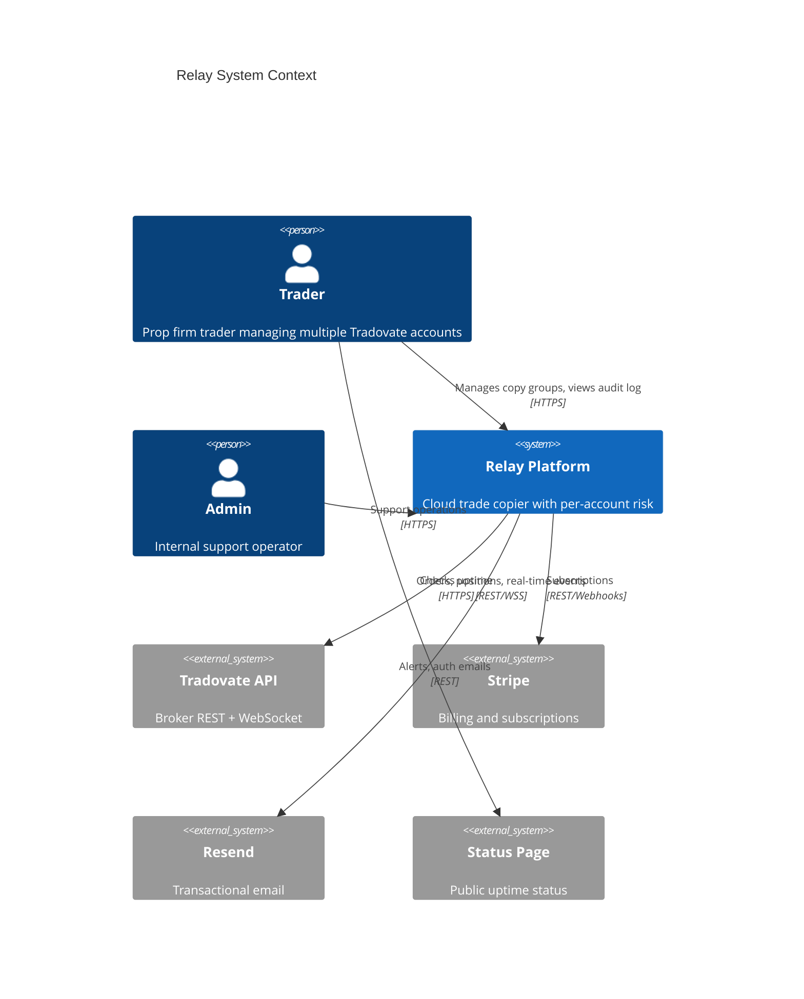
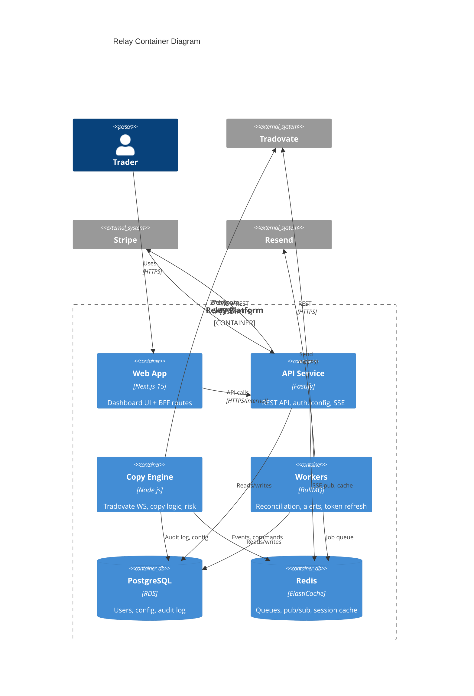

# High-Level Architecture
## Relay — Multi-Account Trade Execution Platform

**Version:** 1.0  
**Date:** June 26, 2026  
**Phase:** 0B

---

## 1. Architecture Goals

| Goal | Decision |
|------|----------|
| **Reliability** | Copy engine isolated from web API; survives API restarts |
| **Latency** | Dedicated long-lived Tradovate WebSocket connections in engine process |
| **Security** | Credentials decrypted only in engine memory; never exposed to frontend |
| **Evolvability** | Broker adapters as pluggable packages; engine shardable by copy group |
| **MVP velocity** | Modular monolith split across 3 deployables, not microservices |

---

## 2. System Context (C4 Level 1)



---

## 3. Container Diagram (C4 Level 2)



---

## 4. Deployable Services

### 4.1 Web App (`apps/web`)
- Next.js 15 App Router
- Trader dashboard, onboarding wizard, billing UI
- Server Actions / Route Handlers proxy to API (no direct DB access)
- SSE client for live event feed

### 4.2 API Service (`apps/api`)
- Fastify REST API
- Authentication (session cookies)
- CRUD: users, broker accounts, copy groups, risk rules
- Stripe webhook handler
- SSE endpoint (subscribes to Redis pub/sub channel `events:{userId}`)
- Does **not** hold Tradovate WebSocket connections

### 4.3 Copy Engine (`apps/engine`)
- Long-running Node.js process (always on)
- One **Connection Manager** per active broker account
- Subscribes to leader order/fill events
- Executes copy pipeline: dedupe → size → risk → submit → audit
- Publishes events to Redis for SSE + queues alert jobs
- **Critical path:** optimized for low latency; no HTTP request handling

### 4.4 Workers (`apps/workers`)
- BullMQ consumers:
  - `reconciliation` — position drift check every 5s per active copy group
  - `token-refresh` — Tradovate token renewal at T-85min
  - `alerts` — email + in-app notification persistence
  - `stripe-sync` — reconcile subscription state

---

## 5. Core Data Flows

### 5.1 Trade Copy (Hot Path)

```
Tradovate WS (leader)
    │ order/fill event
    ▼
Engine: Leader Event Handler
    │ dedupe (Redis SET leader_event_id)
    ▼
Engine: Copy Orchestrator
    │ for each enabled follower (parallel, max 10)
    ├──► Risk Evaluator (pre-copy checks)
    │         │ pass
    │         ▼
    ├──► Size Calculator (fixed | ratio)
    │         │ qty >= 1
    │         ▼
    ├──► Sim Mode? ──yes──► Audit Log + SSE (skip submit)
    │         │ no
    │         ▼
    └──► Tradovate WS (follower) order/placeOrder
              │ ack + fill (async)
              ▼
         Audit Log (PostgreSQL)
              │
              ▼
         Redis PUBLISH events:{userId}
              │
              ▼
         API SSE → Browser
```

**Target latency budget (P95 = 80ms):**

| Stage | Budget |
|-------|--------|
| WS receive → parse | 5ms |
| Dedupe + load config (cache) | 5ms |
| Risk check (in-memory) | 2ms |
| Follower WS submit (×10 parallel) | 50ms |
| Audit persist (async buffer) | 3ms (non-blocking) |
| Redis publish | 5ms |
| **Headroom** | 10ms |

### 5.2 Daily Loss Breach

```
Engine: P&L Monitor (on fill + periodic)
    │ follower daily_pnl <= -daily_loss_limit
    ▼
Risk: Flatten Command
    │ cancel open orders + market close all positions (follower WS)
    ▼
Set follower.status = locked
    │
    ├──► Audit log (breach event)
    ├──► Redis alert job
    └──► Workers: email + in-app notification
```

### 5.3 Account Connection (Cold Path)

```
User → Web → API: POST /broker-accounts/connect
    │ validate subscription limits
    │ encrypt credentials → PostgreSQL
    │ enqueue engine:connect_account
    ▼
Engine: Connection Manager
    │ obtain token → open WS → authorize → user/syncrequest
    ▼
Update broker_account.status = connected
    │ Redis publish status change
    ▼
Dashboard reflects connected state
```

---

## 6. Logical Component Map

```
┌─────────────────────────────────────────────────────────────────┐
│                         PRESENTATION                            │
│  ┌─────────────────────────────────────────────────────────┐   │
│  │  Web Dashboard (Next.js)                                 │   │
│  │  - Copy group config  - Event feed  - Risk settings      │   │
│  └─────────────────────────────────────────────────────────┘   │
└───────────────────────────────┬─────────────────────────────────┘
                                │ HTTPS
┌───────────────────────────────▼─────────────────────────────────┐
│                         APPLICATION                             │
│  ┌──────────────┐  ┌──────────────┐  ┌──────────────────────┐  │
│  │  API Service │  │ Copy Engine  │  │  Workers (BullMQ)    │  │
│  │  Auth, CRUD  │  │  Hot path    │  │  Reconcile, alerts   │  │
│  └──────┬───────┘  └──────┬───────┘  └──────────┬───────────┘  │
└─────────┼─────────────────┼─────────────────────┼───────────────┘
          │                 │                     │
┌─────────▼─────────────────▼─────────────────────▼───────────────┐
│                         DOMAIN PACKAGES                         │
│  ┌────────────┐ ┌────────────┐ ┌────────┐ ┌─────────────────┐  │
│  │ copy-core  │ │    risk    │ │broker- │ │       db        │  │
│  │ sizing,    │ │ daily loss,│ │tradovate│ │ schema, repos  │  │
│  │ brackets   │ │ caps, lock │ │ adapter│ │                 │  │
│  └────────────┘ └────────────┘ └────────┘ └─────────────────┘  │
└───────────────────────────────┬─────────────────────────────────┘
                                │
┌───────────────────────────────▼─────────────────────────────────┐
│                         INFRASTRUCTURE                          │
│     PostgreSQL (RDS)    Redis (ElastiCache)    AWS Secrets Mgr  │
└─────────────────────────────────────────────────────────────────┘
```

---

## 7. Engine Internal Architecture

```
┌──────────────────────────────────────────────────────────────┐
│                      COPY ENGINE PROCESS                      │
│                                                               │
│  ┌─────────────────┐    ┌─────────────────────────────────┐│
│  │  Group Registry │    │     Connection Manager Pool      ││
│  │  (active groups)│───►│  ┌─────┐ ┌─────┐ ┌─────┐ ┌─────┐  ││
│  └─────────────────┘    │  │Acct1│ │Acct2│ │Acct3│ │ ... │  ││
│                          │  │ WS  │ │ WS  │ │ WS  │ │ WS  │  ││
│  ┌─────────────────┐    │  └──┬──┘ └──┬──┘ └──┬──┘ └──┬──┘  ││
│  │ Command Listener│    │     └───────┴───────┴───────┘     ││
│  │ (Redis sub)     │    └─────────────────────────────────┘│
│  └────────┬────────┘                                          │
│           │ connect/disconnect/config reload                  │
│           ▼                                                   │
│  ┌─────────────────────────────────────────────────────────┐│
│  │                  Copy Pipeline (per event)               ││
│  │  Dedupe → Config → Size → Risk → Submit/Sim → Audit     ││
│  └─────────────────────────────────────────────────────────┘│
│                                                               │
│  ┌─────────────────┐    ┌─────────────────┐                  │
│  │  Order Mapping  │    │   P&L Monitor   │                  │
│  │  Store (Redis)  │    │  (per follower) │                  │
│  └─────────────────┘    └─────────────────┘                  │
└──────────────────────────────────────────────────────────────┘
```

---

## 8. Deployment Architecture (AWS MVP)

```
                    ┌──────────────┐
                    │  CloudFront  │
                    │  + WAF       │
                    └──────┬───────┘
                           │
              ┌────────────┼────────────┐
              ▼            ▼            ▼
        ┌──────────┐ ┌──────────┐ ┌──────────┐
        │ Web (ECS)│ │ API (ECS)│ │Engine(ECS│
        │ Fargate  │ │ Fargate  │ │ Fargate) │
        │ 2 tasks  │ │ 2 tasks  │ │ 1 task*  │
        └────┬─────┘ └────┬─────┘ └────┬─────┘
             │            │            │
             └────────────┼────────────┘
                          │
              ┌───────────┼───────────┐
              ▼           ▼           ▼
        ┌──────────┐ ┌─────────┐ ┌──────────┐
        │ RDS      │ │ Redis   │ │ Secrets  │
        │ Postgres │ │ElastiCache│ │ Manager  │
        └──────────┘ └─────────┘ └──────────┘

        * Engine: 1 task MVP; shard by copy_group_id in Phase 2
```

**Environments:**

| Env | Tradovate | Purpose |
|-----|-----------|---------|
| `dev` | Demo API | Local development |
| `staging` | Demo API | CI, QA, load tests |
| `prod` | Live API | Production users |

---

## 9. Failure Modes & Resilience

| Failure | Detection | Response |
|---------|-----------|----------|
| Leader WS disconnect | Heartbeat timeout | Reconnect + exponential backoff; alert after 3 failures |
| Follower copy fail | Order reject/timeout | Retry 3×; pause follower; alert |
| Engine process crash | ECS health check | Restart; reload groups from DB; reconnect all WS |
| Token expired mid-session | 401 from Tradovate | Token refresh job; re-authorize WS |
| PostgreSQL unavailable | Connection error | Engine buffers audit to Redis (max 1000 events); API returns 503 |
| Redis unavailable | Connection error | Engine continues copy (degraded: no SSE); queue alerts to PG fallback table |

---

## 10. Phase 2 Architecture Extensions

| Extension | Approach |
|-----------|----------|
| **Engine sharding** | Consistent hash on `copy_group_id` → N engine instances |
| **Rithmic adapter** | New `packages/broker-rithmic`; engine loads adapter by account type |
| **Public API** | API gateway + API keys; rate limit per key |
| **TradingView leader** | Webhook ingress service → normalize to internal `LeaderEvent` |
| **Read replica** | Dashboard queries → PG replica; writes → primary |

---

## Related Documents
- [SRS.md](./SRS.md)
- [LOW_LEVEL_DESIGN.md](./LOW_LEVEL_DESIGN.md)
- [TECHNOLOGY_DECISIONS.md](./TECHNOLOGY_DECISIONS.md)
- [SECURITY_PLAN.md](./SECURITY_PLAN.md)
