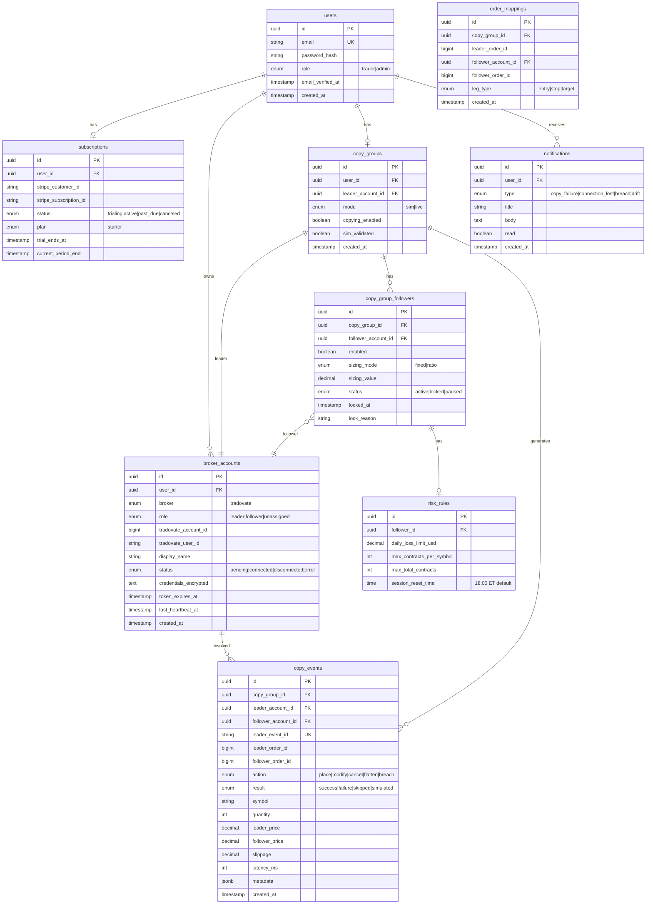
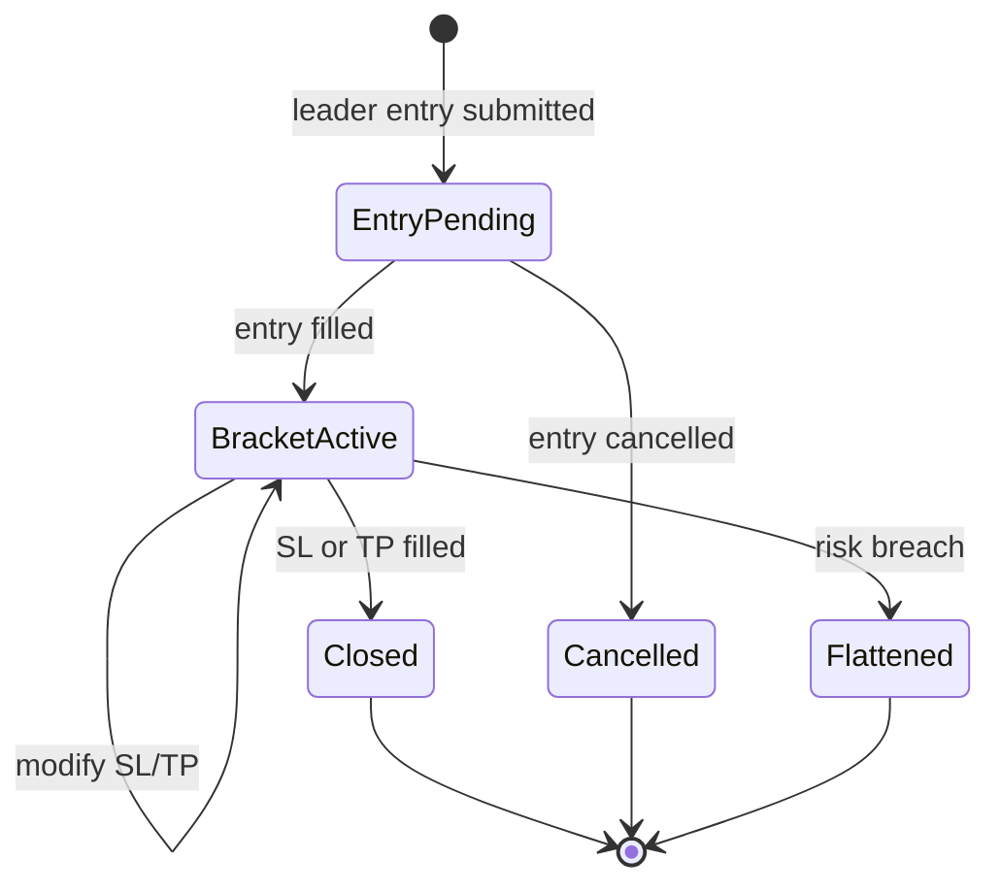
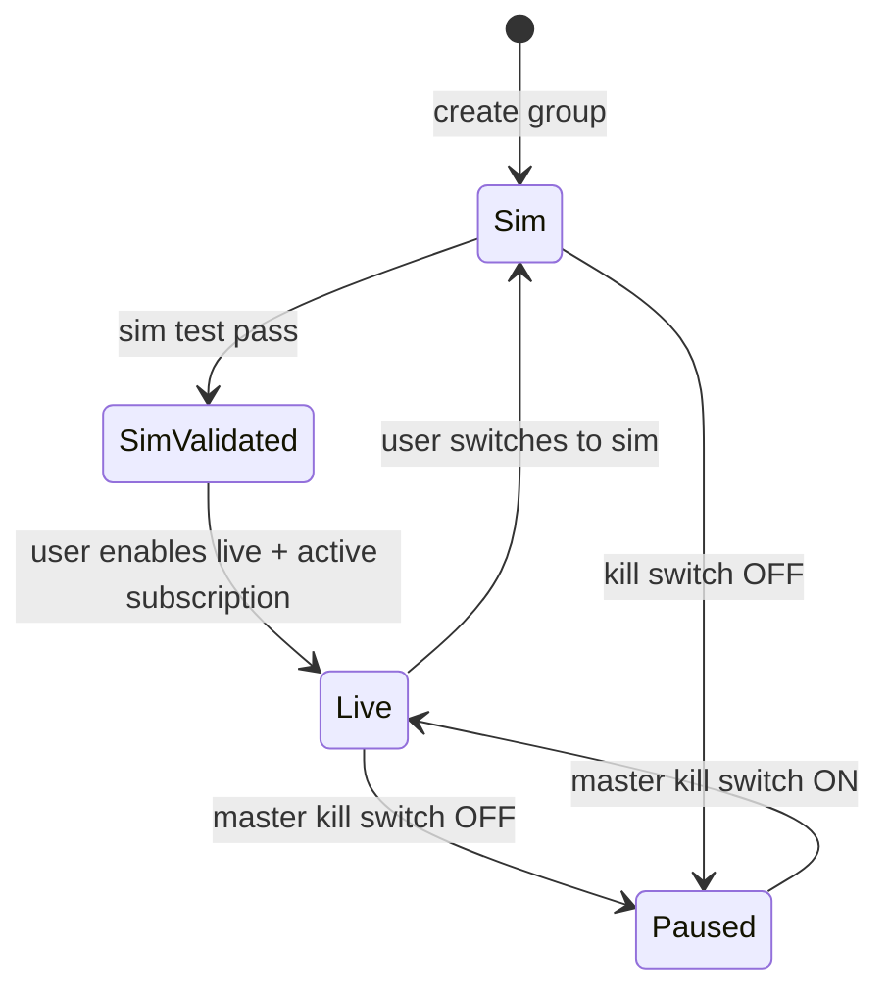
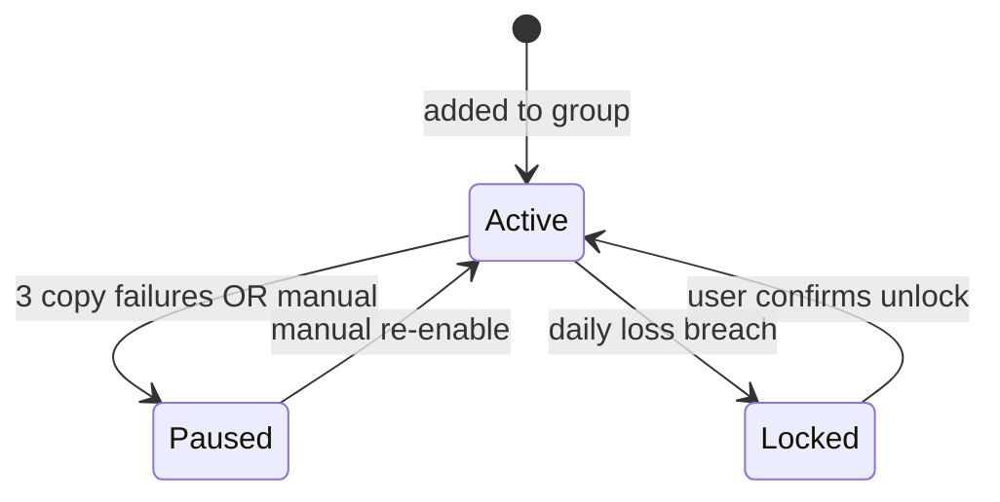
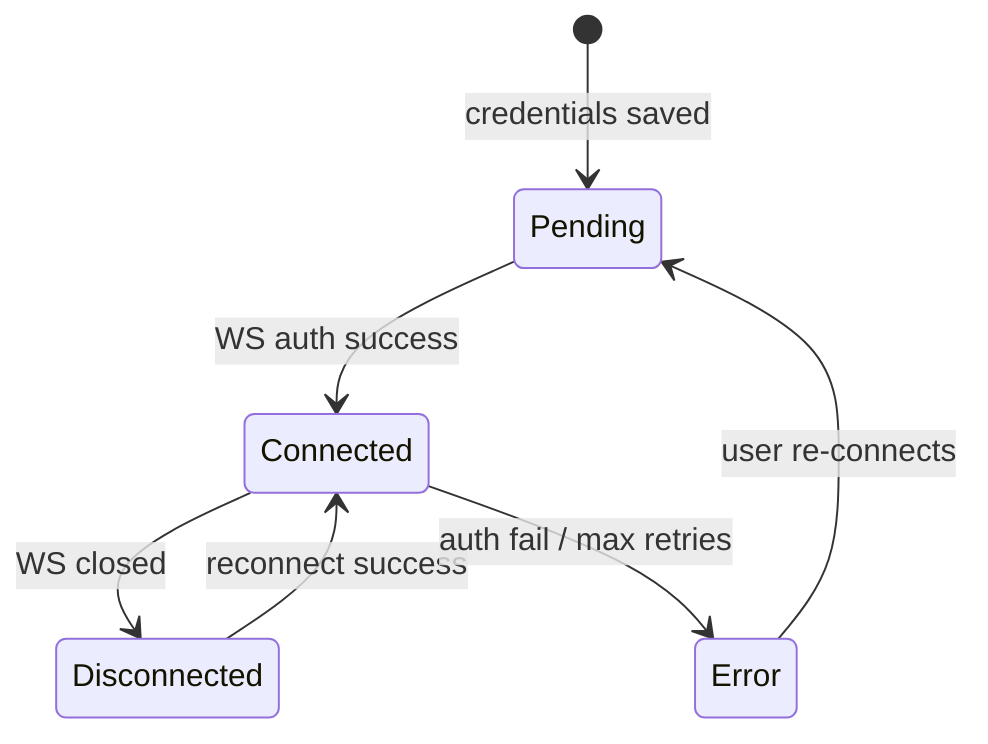
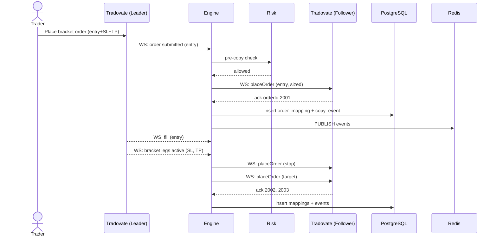
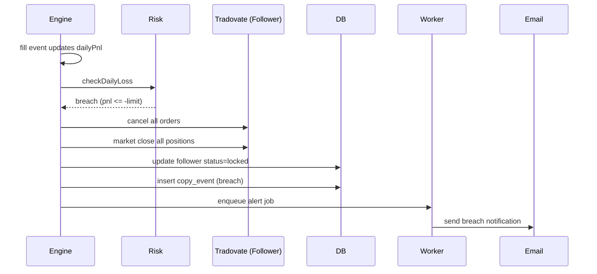

# Low-Level Design (LLD)
## Relay — Multi-Account Trade Execution Platform

**Version:** 1.0  
**Date:** June 26, 2026  
**Phase:** 0B

---

## 1. Database Schema

### 1.1 Entity Relationship Diagram



### 1.2 Key Indexes

```sql
-- Copy events: dashboard feed + audit queries
CREATE INDEX idx_copy_events_group_created ON copy_events (copy_group_id, created_at DESC);
CREATE INDEX idx_copy_events_leader_event ON copy_events (leader_event_id);

-- Order mappings: modify/cancel lookup
CREATE UNIQUE INDEX idx_order_mappings_lookup
  ON order_mappings (copy_group_id, leader_order_id, follower_account_id, leg_type);

-- Broker accounts: engine startup load
CREATE INDEX idx_broker_accounts_status ON broker_accounts (status) WHERE status = 'connected';

-- Notifications: unread feed
CREATE INDEX idx_notifications_user_unread ON notifications (user_id, read, created_at DESC);
```

### 1.3 Copy Events — Append-Only Policy
- Application role `relay_app` has INSERT only on `copy_events`
- No UPDATE/DELETE grants in production
- Partition by month in Phase 2 when volume exceeds 10M rows

---

## 2. Domain Models (TypeScript)

### 2.1 LeaderEvent (internal normalized event)

```typescript
interface LeaderEvent {
  id: string;                    // dedupe key: `${accountId}:${tradovateEventId}`
  accountId: string;
  copyGroupId: string;
  type: 'order_submitted' | 'order_modified' | 'order_cancelled' | 'fill';
  orderId: number;
  parentOrderId?: number;        // bracket parent
  legType?: 'entry' | 'stop' | 'target';
  symbol: string;
  contractId: number;
  action: 'Buy' | 'Sell';
  orderType: 'Market' | 'Limit' | 'Stop' | 'StopLimit';
  quantity: number;
  price?: number;
  stopPrice?: number;
  filledQuantity?: number;
  avgFillPrice?: number;
  timestamp: Date;
  raw: unknown;                  // Tradovate payload for audit
}
```

### 2.2 CopyDecision

```typescript
interface CopyDecision {
  followerAccountId: string;
  action: 'submit' | 'modify' | 'cancel' | 'skip' | 'simulated';
  skipReason?: 'disabled' | 'locked' | 'size_zero' | 'risk_blocked' | 'sim_mode';
  quantity: number;
  orderType: string;
  price?: number;
  stopPrice?: number;
  parentMappingId?: string;
}
```

### 2.3 CopyResult

```typescript
interface CopyResult {
  decision: CopyDecision;
  result: 'success' | 'failure' | 'skipped' | 'simulated';
  followerOrderId?: number;
  latencyMs: number;
  leaderPrice?: number;
  followerPrice?: number;
  slippage?: number;
  error?: string;
}
```

---

## 3. Copy Engine — Detailed Design

### 3.1 Connection Manager

**Responsibility:** One Tradovate WebSocket session per `broker_account`.

```typescript
class TradovateConnection {
  private ws: WebSocket;
  private heartbeatTimer: NodeJS.Timeout;
  private requestId = 0;
  private pendingRequests: Map<number, PendingRequest>;

  async connect(credentials: DecryptedCredentials): Promise<void>;
  async authorize(accessToken: string): Promise<void>;
  async subscribeUserSync(): Promise<void>;
  sendHeartbeat(): void;  // '[]' every 2500ms

  async placeOrder(params: PlaceOrderParams): Promise<OrderResponse>;
  async modifyOrder(params: ModifyOrderParams): Promise<OrderResponse>;
  async cancelOrder(orderId: number): Promise<void>;
  async flattenAll(): Promise<void>;

  onEvent(handler: (event: TradovateEntityEvent) => void): void;
  onDisconnect(handler: () => void): void;
}
```

**Reconnection strategy:**
```
attempt 1: immediate
attempt 2: 1s
attempt 3: 2s
attempt 4: 4s
attempt 5: 8s
attempt 6+: 30s (cap)
alert user after attempt 3 failures within 5 minutes
```

**Token refresh:** Scheduled job at `token_expires_at - 5 minutes`. On refresh:
1. Obtain new token via REST
2. Update DB + in-memory credential
3. Re-send `authorize` on existing WS (no full reconnect if WS healthy)

### 3.2 Copy Orchestrator

```typescript
class CopyOrchestrator {
  async handleLeaderEvent(event: LeaderEvent): Promise<void> {
    // 1. Dedupe
    if (await this.redis.set(`dedupe:${event.id}`, '1', 'EX', 86400, 'NX') === null) {
      return;
    }

    const group = await this.configCache.getCopyGroup(event.copyGroupId);
    if (!group.copyingEnabled) return;

    const startMs = Date.now();
    const decisions = await this.planCopies(event, group);

    // Parallel follower execution (Promise.allSettled)
    const results = await Promise.allSettled(
      decisions.map(d => this.executeCopy(event, d, group))
    );

    // Async audit persist (don't block hot path)
    this.auditWriter.enqueue(results, Date.now() - startMs);
  }
}
```

### 3.3 Bracket Order Mapping

Bracket orders on Tradovate arrive as linked orders via `parentOrderId`.

```
Leader bracket placed:
  entry_order_id: 1001
  stop_order_id:  1002 (parent=1001, leg=stop)
  target_order_id:1003 (parent=1001, leg=target)

Follower mapping stored in order_mappings:
  (group, 1001, follower_A) → follower_entry_id: 2001
  (group, 1002, follower_A) → follower_stop_id:   2002
  (group, 1003, follower_A) → follower_target_id: 2003

On leader stop modify (1002 price change):
  lookup mapping → modify follower 2002
```

**Bracket state machine:**



### 3.4 Size Calculator

```typescript
function calculateFollowerQuantity(
  leaderQty: number,
  config: CopyGroupFollower
): number {
  if (config.sizingMode === 'fixed') {
    return config.sizingValue;
  }
  // ratio mode
  return Math.max(0, Math.round(leaderQty * config.sizingValue));
}
```

Partial fills: replicate filled quantity proportionally on fill events, not on initial submit.

### 3.5 Risk Evaluator

```typescript
class RiskEvaluator {
  checkPreCopy(
    follower: CopyGroupFollower,
    rules: RiskRules,
    state: FollowerState,
    proposedOrder: ProposedOrder
  ): RiskCheckResult {
    if (follower.status === 'locked') return { allowed: false, reason: 'locked' };
    if (follower.status === 'paused') return { allowed: false, reason: 'paused' };

    const newSymbolExposure = state.openContractsBySymbol[proposedOrder.symbol] ?? 0;
    if (newSymbolExposure + proposedOrder.quantity > rules.maxContractsPerSymbol) {
      return { allowed: false, reason: 'symbol_cap' };
    }

    const newTotal = state.totalOpenContracts + proposedOrder.quantity;
    if (newTotal > rules.maxTotalContracts) {
      return { allowed: false, reason: 'total_cap' };
    }

    return { allowed: true };
  }

  checkDailyLoss(
    follower: CopyGroupFollower,
    rules: RiskRules,
    state: FollowerState
  ): BreachResult | null {
    if (state.dailyPnl <= -rules.dailyLossLimitUsd) {
      return { action: 'flatten_and_lock', reason: 'daily_loss' };
    }
    return null;
  }
}
```

**P&L calculation:** Updated on every fill event for follower + periodic REST poll every 30s as backup.

### 3.6 Follower State (in-memory + Redis)

```typescript
interface FollowerState {
  accountId: string;
  dailyPnl: number;                          // resets at session_reset_time
  dailyPnlResetAt: Date;
  totalOpenContracts: number;
  openContractsBySymbol: Record<string, number>;
  consecutiveFailures: number;
  lastFillAt?: Date;
}
```

Redis key: `follower_state:{accountId}` — TTL none; rebuilt from Tradovate on engine start.

---

## 4. API Design

### 4.1 REST Endpoints (API Service)

Base URL: `https://api.relay.trade/v1`

#### Auth
| Method | Path | Description |
|--------|------|-------------|
| POST | `/auth/register` | Create account |
| POST | `/auth/login` | Login, set session cookie |
| POST | `/auth/logout` | Destroy session |
| POST | `/auth/forgot-password` | Send reset email |
| POST | `/auth/reset-password` | Reset with token |

#### Broker Accounts
| Method | Path | Description |
|--------|------|-------------|
| GET | `/broker-accounts` | List user's accounts |
| POST | `/broker-accounts/connect` | Connect Tradovate account |
| DELETE | `/broker-accounts/:id` | Disconnect + purge credentials |
| GET | `/broker-accounts/:id/status` | Connection health |

#### Copy Groups
| Method | Path | Description |
|--------|------|-------------|
| GET | `/copy-groups` | Get user's copy group |
| PUT | `/copy-groups` | Create/update copy group |
| PATCH | `/copy-groups/mode` | Set sim/live |
| PATCH | `/copy-groups/enabled` | Master kill switch |
| POST | `/copy-groups/sim-test` | Run sim validation wizard |

#### Followers
| Method | Path | Description |
|--------|------|-------------|
| PATCH | `/copy-groups/followers/:id` | Update sizing, enabled |
| POST | `/copy-groups/followers/:id/unlock` | Manual unlock after breach |

#### Risk Rules
| Method | Path | Description |
|--------|------|-------------|
| PUT | `/copy-groups/followers/:id/risk` | Set daily loss, caps |

#### Events & Notifications
| Method | Path | Description |
|--------|------|-------------|
| GET | `/copy-events` | Paginated audit log |
| GET | `/copy-events/stream` | SSE real-time feed |
| GET | `/notifications` | In-app notifications |
| PATCH | `/notifications/:id/read` | Mark read |

#### Billing
| Method | Path | Description |
|--------|------|-------------|
| POST | `/billing/checkout` | Create Stripe Checkout session |
| POST | `/billing/portal` | Stripe Customer Portal |
| POST | `/webhooks/stripe` | Stripe webhook (unsigned route, signature verified) |

#### Admin
| Method | Path | Description |
|--------|------|-------------|
| GET | `/admin/users` | List users (admin only) |
| GET | `/admin/copy-events/stats` | Failure rates |

### 4.2 SSE Event Format

```
event: copy_event
data: {"id":"...","action":"place","result":"success","latencyMs":42,...}

event: connection_status
data: {"accountId":"...","status":"connected"}

event: breach
data: {"followerId":"...","reason":"daily_loss","dailyPnl":-502.00}
```

### 4.3 Engine Command Channel (Redis)

Engine subscribes to `engine:commands`:

```typescript
type EngineCommand =
  | { type: 'connect_account'; accountId: string }
  | { type: 'disconnect_account'; accountId: string }
  | { type: 'reload_group'; copyGroupId: string }
  | { type: 'flatten_follower'; accountId: string; reason: string };
```

API publishes commands after config changes; engine reloads in-memory cache within 1s.

---

## 5. Tradovate Adapter (`packages/broker-tradovate`)

### 5.1 Package Structure

```
broker-tradovate/
├── src/
│   ├── client/
│   │   ├── rest-client.ts       # HTTP wrapper
│   │   ├── ws-client.ts         # WebSocket protocol
│   │   └── token-manager.ts     # 85-min refresh
│   ├── mappers/
│   │   ├── order-mapper.ts      # Tradovate ↔ domain
│   │   └── event-mapper.ts      # WS entity → LeaderEvent
│   ├── types/
│   │   └── tradovate.ts         # Generated/manual types
│   └── index.ts
└── tests/
    ├── ws-client.test.ts
    └── event-mapper.test.ts
```

### 5.2 WebSocket Protocol

Per [Tradovate API](https://api.tradovate.com/):

```
Message format: endpoint\nrequestId\n\nbody

Auth:     authorize\n0\n\n{accessToken}
Sync:     user/syncrequest\n1\n\n{"splitResponses":false}
Heartbeat: []
Order:    order/placeOrder\n{id}\n\n{orderJson}
```

### 5.3 Environment URLs

| Env | REST | WebSocket |
|-----|------|-----------|
| Demo | `https://demo.tradovateapi.com/v1` | `wss://demo.tradovateapi.com/v1/websocket` |
| Live | `https://live.tradovateapi.com/v1` | `wss://live.tradovateapi.com/v1/websocket` |

---

## 6. Background Jobs (BullMQ)

| Queue | Job | Schedule | Handler |
|-------|-----|----------|---------|
| `reconciliation` | `check-group` | Every 5s per active group | Compare positions; alert drift |
| `token-refresh` | `refresh-account` | Cron per account expiry | Refresh Tradovate token |
| `alerts` | `send-email` | On demand | Resend template send |
| `alerts` | `persist-notification` | On demand | Insert notification row |
| `daily-reset` | `reset-daily-pnl` | Cron 6 PM ET | Reset follower daily P&L counters |

---

## 7. Caching Strategy

| Key Pattern | TTL | Purpose |
|-------------|-----|---------|
| `copy_group:{id}` | 60s | Engine config cache |
| `dedupe:{eventId}` | 24h | Idempotency |
| `follower_state:{id}` | none | P&L + exposure |
| `order_map:{group}:{leaderOrderId}:{followerId}` | 7d | Bracket mapping |
| `session:{token}` | 7d | User session |

Config invalidation: API publishes `engine:commands` with `reload_group` on any PUT/PATCH to copy group.

---

## 8. State Machines

### 8.1 Copy Group Mode



### 8.2 Follower Account Status



### 8.3 Broker Connection



---

## 9. Sequence Diagrams

### 9.1 Bracket Copy (Live Mode)



### 9.2 Daily Loss Breach



---

## 10. Error Codes

| Code | HTTP | Description |
|------|------|-------------|
| `AUTH_INVALID` | 401 | Session expired or invalid |
| `FORBIDDEN` | 403 | Insufficient permissions |
| `PLAN_LIMIT` | 402 | Exceeds subscription follower limit |
| `ACCOUNT_DUPLICATE` | 409 | Broker account already linked |
| `COPY_GROUP_INVALID` | 422 | Missing leader or no followers |
| `SIM_NOT_VALIDATED` | 422 | Live mode blocked until sim test |
| `FOLLOWER_LOCKED` | 422 | Follower locked; unlock required |
| `BROKER_CONNECT_FAILED` | 502 | Tradovate connection error |

---

## Related Documents
- [HIGH_LEVEL_ARCHITECTURE.md](./HIGH_LEVEL_ARCHITECTURE.md)
- [TECHNOLOGY_DECISIONS.md](./TECHNOLOGY_DECISIONS.md)
- [FOLDER_STRUCTURE.md](./FOLDER_STRUCTURE.md)
- [SECURITY_PLAN.md](./SECURITY_PLAN.md)
